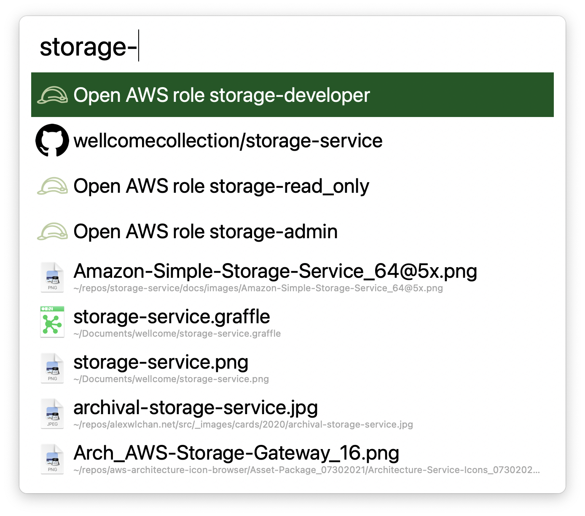

# aws_console_alfred_shortcuts

This is a script to help me create an [Alfred Workflow] that lets me switch between roles in the AWS console quickly.

I work with a lot of [different roles] – when I pick a role using this workflow, it switches to that role in my frontmost Safari tab.
For example, if I'm looking at Route 53 in account A, and I select a role in account B, then this workflow will switch me to Route 53 in account B.



[different roles]: https://github.com/wellcomecollection/platform-infrastructure/tree/main/accounts
[Alfred Workflow]: https://www.alfredapp.com/workflows/


## Usage

If you want to use this script yourself, you'll need Python installed.

Clone this repo, update the list of roles in `accounts.json`, then run the script:

```
$ python3 create_workflow.py
```

This will create a package `aws_console_roles.alfredworkflow` in the repo; open this to get the shortcut.
